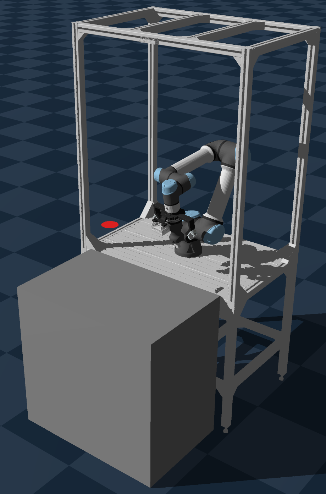

# aegis_gym

The collection of [Gymnasium](https://gymnasium.farama.org/) environments for the Aegis UR5e station.

[](https://github.com/astral-sh/uv)
[](https://github.com/astral-sh/ruff)
[](https://opensource.org/licenses/Apache-2.0)
[](https://github.com/pre-commit/pre-commit)
[](https://github.com/j178/prek)

<p align="center">
    
</p>

---

## Notes
* All poses consist of position `x,y,z` and orientation in quaterion form `qx,qy,qz,qw`, i.e.: `pose=[x,y,z,qx,qy,qz,qw]`
* For simplicity, the project uses Pytorch tensors instead of numpy ones.

---

## Containerfile
Check the corresponding [README.md](./container/README.md).

## Build & install
```bash
uv build
pip3 install ./dist/aegis_gym-*.whl
# Combined command:
uv build && pip3 uninstall aegis_gym -y && pip3 install "./dist/aegis_gym-0.0.1-py3-none-any.whl[sim-genesis]"
```

## Run tests
```bash
uv run pytest -v -s
```
## Run test training
```bash
python3 ./test/sb3_run_train.py
```

---
## Utilities

Check out the [utils README](./utils/README.md).

---
## Development notes

This project uses various tools for aiding the quality of the source code. Currently most of them are executed by the `pre-commit`. As a faster alternative it is suggested to use `prek`. Please make sure to enable its hooks:

```bash
# In case of pre-commit
pre-commit install
# In case of prek
prek install
```

---
## License
This repository is licensed under the Apache 2.0, see LICENSE for details.
