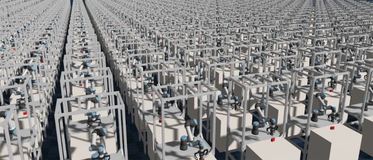
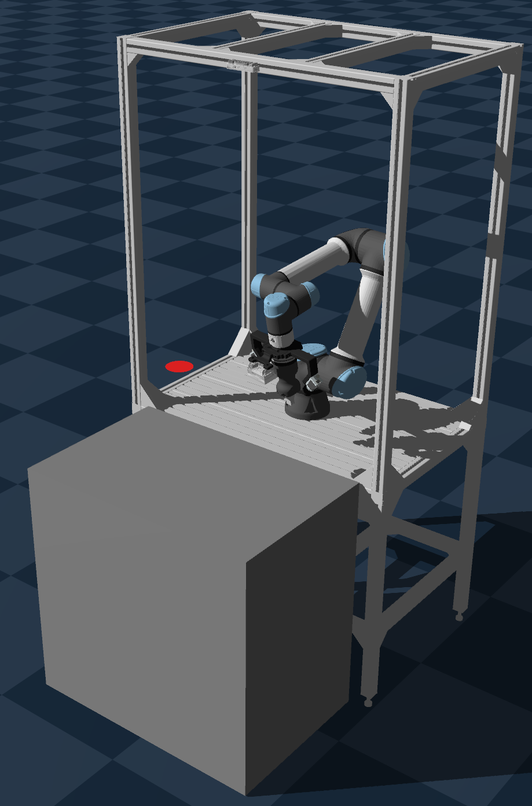

# aegis_gym

[](https://github.com/astral-sh/uv)
[](https://github.com/astral-sh/ruff)
[](https://opensource.org/licenses/Apache-2.0)
[](https://github.com/pre-commit/pre-commit)
[](https://github.com/j178/prek)

<div align="center">
The collection of <a href="https://github.com/leggedrobotics/rsl_rl">RSL-RL</a> reinforcement learning environments for the <a href="https://github.com/AGH-CEAI/pprai2026_drl_robotic_station">Aegis UR5e station</a>.<br>
Featuring real-time control of the physical robot via a <a href="https://github.com/AGH-CEAI/aegis_ros/tree/humble-devel/aegis_grpc">gRPC&lt;-&gt;ROS 2 bridge</a> and <a href="https://genesis-world.readthedocs.io/">Genesis World</a> simulator scenes.
</div>

<p align="center">
<br>
<i>"4096 units are ready, with a million more well on the way." ~ Lab staff</i>
</p>

> [!IMPORTANT]
> This repository is tightly coupled with the [`aegis_ros`](https://github.com/AGH-CEAI/aegis_ros) project for sim-to-real experiments.

> [!CAUTION]
> The scripts for training and evaluation ([`train.py`](./train.py), [`eval.py`](./eval.py), [`hpo.py`](./hpo.py)), as well as the entire collection of [runners](./aegis_gym/runners/) code, will be migrated to new repositories. Until the migration is complete, this repository depends on tight integration with a self-hosted [ClearML](https://clear.ml/) server!


---
## Environments catalogue

|     |     |     |
| --- | --- | --- |
| [**Reacher**](./aegis_gym/envs/reacher_env.py) | **T-Pusher**     | **Peg-in-Hole**     |
|  | W.I.P.     | W.I.P.     |


---

## Containers
Check the corresponding [README.md](./container/README.md).

---

## Run

> [!TIP]
> Use the `-h` flag for `train.py` and `eval.py` scripts to print extensive information regarding all launch arguments.


### Build & install
```bash
uv build
pip3 install ./dist/aegis_gym-*.whl
# Combined command:
uv build && pip3 uninstall aegis_gym -y && pip3 install "./dist/aegis_gym-0.0.1-py3-none-any.whl[sim-genesis]"
```

### Train
```bash
# Add flag `--control=ros` for real robot control (needs the ROS stack in other container)
python3 train.py -a=rl --num-envs=5 --max-iterations=10 -e REACHER_TRAIN
python3 train.py -a=bc --num-envs=2 --max-iterations=50 --load-rl-task=<CLEARML_TASK_ID> -e REACHER_TRAIN
```

### Evaluation
```bash
# Add flag `--control=ros` for real robot control (needs the ROS stack in other container)
python3 eval.py -a=rl --num-envs=1 --load-rl-task=<CLEARML_TASK_ID> -e EVAL_REACHER
python3 eval.py -a=bc --num-envs=10 --load-bc-task=<CLEARML_TASK_ID> -e EVAL_REACHER
```

---
## Interaction with ClearML

Check out the [clearml_utils repo](https://github.com/AGH-CEAI/clearml_utils).

---
## Development notes

### Varia

* This project uses the [uv](https://docs.astral.sh/uv/) package manager.
* All poses consist of position `x,y,z` and orientation in quaterion form `qx,qy,qz,qw`, i.e.: `pose=[x,y,z,qx,qy,qz,qw]` (This is the Genesis notation, **it differs from ROS 2**).
* For simplicity, the project uses Pytorch tensors instead of numpy ones.

### Automatic tests

To run automatic tests type in the main repo directory:
```bash
uv run --extra test pytest -v .
```

### pre-commit / prek

This project uses various tools for aiding the quality of the source code. Currently most of them are executed by the `pre-commit`. As a faster alternative it is suggested to use `prek`. Please make sure to enable its hooks:

```bash
# In case of pre-commit
pre-commit install
# In case of prek
prek install
```

---
## License
This repository is licensed under the Apache 2.0, see LICENSE for details.
